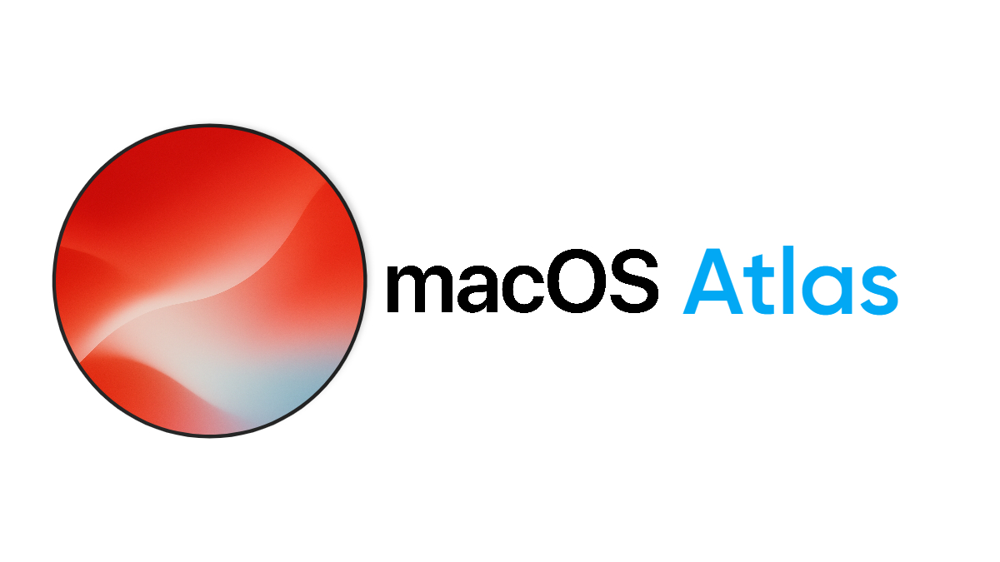
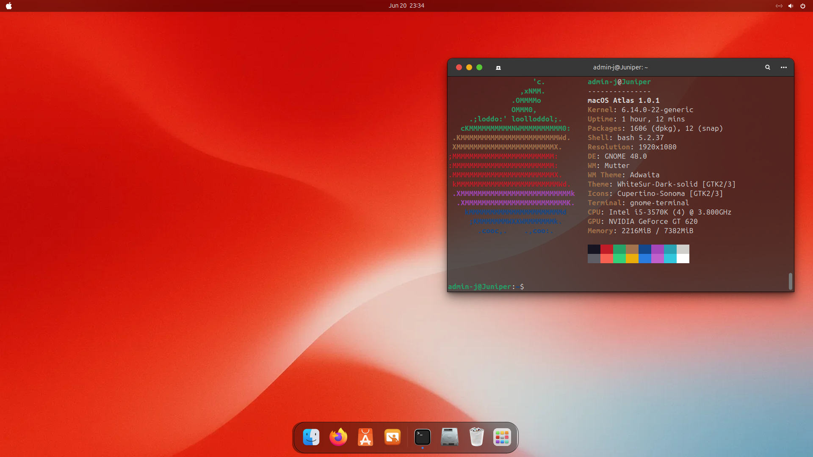

# Welcome to MacOS Atlas

##### Warning: This is a concept distro, all rights go to apple and no profit is made from this. No code is used that belongs to apple in anyway.

#### This is MacOS Atlas, an ubuntu based concept distro meant to show off concept from the community. Right now, the OS is in development, more will be noted in the future.

#### Current Features
##### - Fully editable distro, with every picture able to be changed no matter what. This way, Juniper will truly be yours to edit however you want. This allows for custom icon packs!
##### - Back to basic with a design based on Ventura
##### - New design, Aero! This new design will define Atlas as a unique concept distro with it's own flair
##### - Built in Wine support for those who want their software compatibility
##### - Slow but huge updates every 6 months

###### Your future desktop

##### My current release, Bloom, will be the base of what Atlas will evolve to be. Bloom 1.0.1 will release this winter as a limited time preview.
